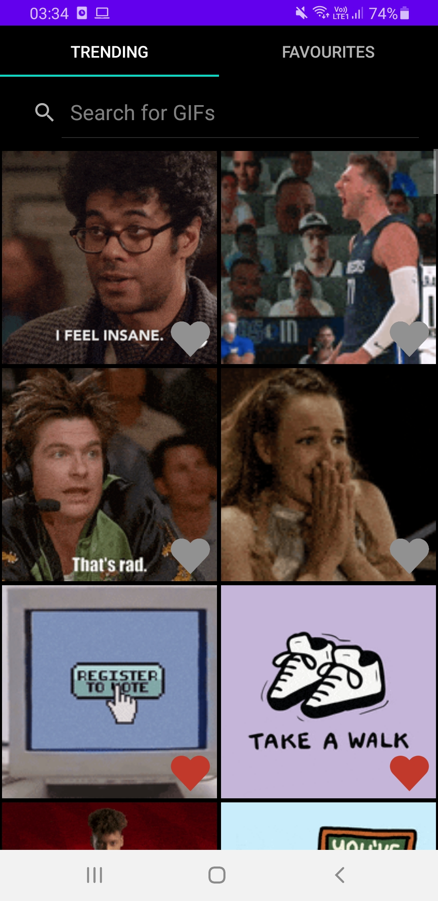
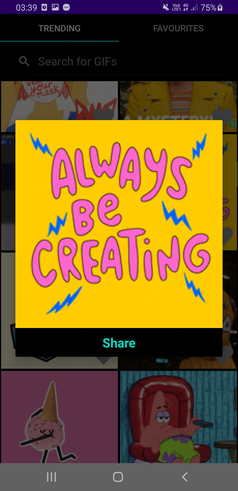

# Giphy-Gallery
A browser for GIFs from Giphy using MVVM, Android Paging Library, Room, Koin, Lottie

- 100% Kotlin
- Written following MVVM Architecture
- Used Coroutines, Livedata and Flow instead of RxJava
- Infinite scroll is implemented using Android Paging Library
- Unit and Integration Testing
- Marking Favourites handled reactively with DB as single source of truth
- Used Koin for DI
- Shimmering Placeholder animation when GIF is loading (Similar to original Giphy app)
- Used Lottie for animation
- Popup View when clicked on GIF, which initially loads thumbnail while loading the original GIF in the background
- Option to share GIF URL to other apps
- Fully handled Landscape view, even RecyclerView scroll positions remain unchanged and Popup state will also be maintained
- Reactive Search
- App based on Dark Theme

--------
**Screenshots**

